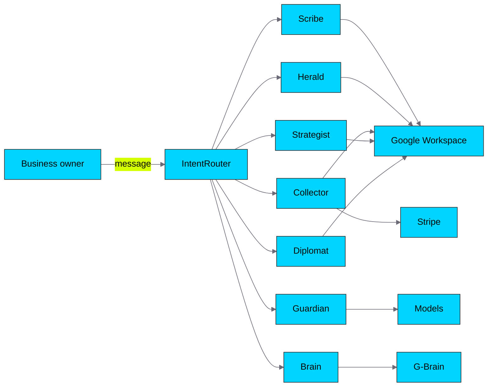
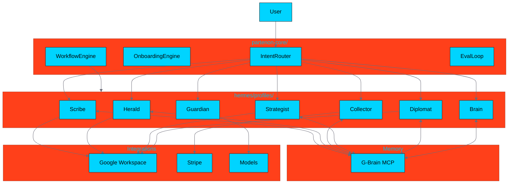

# Partenon

```text
    ____             __                   __
   / __ \____ ______/ /_____  _________ _/ /_
  / /_/ / __ `/ ___/ //_/ _ \/ ___/ __ `/ __/
 / ____/ /_/ / /__/ ,< /  __/ /  / /_/ / /_
/_/    \__,_/\___/_/|_|\___/_/   \__,_/\__/

AI agent operating system for small businesses
```

[](https://hermespartenon.online/)
[](https://github.com/cuentadeservicio377-cell/partenon)
[](https://www.python.org/)
[](https://nextjs.org/)
[](LICENSE)

**Partenon is an open-source AI agent operating system that turns a small business into a team of specialized agents.** Each agent has a clear territory, shares memory with the others, and delivers work inside the tools you already use: Google Sheets, Docs, Calendar, Gmail, and Stripe.

> This README is code-first and grounded in the actual repository. For marketing copy, visit [hermespartenon.online](https://hermespartenon.online/).

---

## What is Partenon

Partenon is not a chatbot. It is a coordination layer: one company profile (Hermes), seven specialized hero profiles, and shared memory (G-Brain). The core routes your intent to the right hero, runs onboarding, orchestrates multi-hero workflows, and evaluates output quality.



- **Hermes** = the company profile. It publishes missions because the business needs help.
- **The heroes** = seven agent profiles with distinct roles and tools.
- **The Partenon** = Hermes + heroes working together.
- **G-Brain** = shared memory that keeps context across missions.

---

## Real use cases

### 1. Coffee shop: know your margin every week

The Scribe imports POS and expense data, classifies fixed costs (rent, salaries) and variable costs (beans, milk, ads), and writes a margin dashboard to Google Sheets. The Strategist adds weekly inventory reminders. The Collector sets up Stripe payment links for catering orders.

**Outcome:** A live P&L the owner reviews in 2 minutes every Monday.

### 2. Consulting agency: never lose a follow-up

The Strategist manages projects and deadlines. The Diplomat registers clients, logs calls, and schedules follow-ups. The Scribe tracks project budgets and flags margin erosion. The Collector invoices retainers and milestones.

**Outcome:** Projects stay on schedule, invoices go out on time, and no prospect falls through the cracks.

### 3. SaaS startup: secure, repeatable operations

The Guardian audits API keys and enforces least-privilege permissions. The Scribe tracks cloud spend and runway. The Strategist runs OKRs and sprint reminders. The Collector manages Stripe subscriptions and failed-payment recovery. The Brain indexes architectural decisions.

**Outcome:** Security, finance, and operations run on autopilot instead of ad-hoc spreadsheets.

---

## Quick install

```bash
git clone https://github.com/cuentadeservicio377-cell/partenon.git
cd partenon
python3 -m venv .venv
source .venv/bin/activate
pip install -r requirements.txt
python scripts/demo_tesorero.py
```

In about 60 seconds you will have:

- `data/sample_expenses.xlsx` — a styled finance workbook.
- `data/sample_expenses_report.json` — income, expenses, margin, and alerts.

For the full setup helper, run `./install.sh` or `python scripts/setup_hermes.py`.

For a 15-minute guided tour, read [`docs/QUICKSTART.md`](docs/QUICKSTART.md).

---

## The seven heroes

| Hero | Territory | Primary file | Real outputs |
|------|-----------|--------------|--------------|
| **Scribe** / Treasurer | Finance, budgets, vendors | `.finance` | Expense workbook, margin dashboard, vendor report |
| **Herald** / Messenger | Brand, content, SEO/GEO, email | `.design` | Brand brief, content calendar, slide deck, copy |
| **Collector** | Payments, Stripe, subscriptions | `.payments` | Payment links, invoices, subscriptions, reminders |
| **Guardian** | Security, API keys, permissions | `.security` | Key rotation log, permission audit, security events |
| **Strategist** | Operations, projects, calendar | `.ops` | Project plans, tasks, briefings, calendar events |
| **Diplomat** | Clients, vendors, CRM | `.relations` | CRM sheet, meeting invites, proposals, follow-ups |
| **Brain** | Memory, context, decisions | `.brain` | Memory pages, insight summaries, onboarding context |

For the full capability matrix, see [`docs/assets/hero-matrix.md`](docs/assets/hero-matrix.md). For deep technical details on each hero, see [`docs/HERO_GUIDE.md`](docs/HERO_GUIDE.md).

---

## Architecture



### Repository structure

```text
partenon/
├── dashboard/              # Next.js 15 + React 19 operations dashboard
├── docs/                   # Documentation (this README links to it)
│   ├── ENTREPRENEUR_PLAYBOOK.md
│   ├── HERO_GUIDE.md
│   ├── QUICKSTART.md
│   ├── SECURITY.md
│   ├── API.md
│   ├── FAQ.md
│   └── assets/
├── examples/               # CLI/API/MCP stubs
├── gbrain/                 # Local G-Brain MCP server
├── hermes/profiles/        # Seven hero profiles
├── partenon-core/tools/    # Router, onboarding, workflow, eval loop
├── scripts/                # Demos and setup helpers
├── templates/              # Google Sheets templates
├── web/                    # Static marketing pages
├── install.sh
├── requirements.txt
└── docker-compose.yml
```

For the architecture diagram source, see [`docs/assets/architecture-diagram.mmd`](docs/assets/architecture-diagram.mmd).

---

## Dashboard

```bash
cd dashboard
npm install
npm run dev
```

Open http://localhost:3000. Default credentials: `admin` / `partenon` (change via `.env`). The dashboard reads and writes `data/tasks.json` and `data/cron.json`.

---

## Documentation

| Document | Who it is for |
|----------|---------------|
| [`docs/QUICKSTART.md`](docs/QUICKSTART.md) | Anyone who wants a working demo in 15 minutes |
| [`docs/ENTREPRENEUR_PLAYBOOK.md`](docs/ENTREPRENEUR_PLAYBOOK.md) | Business owners choosing which heroes to activate |
| [`docs/HERO_GUIDE.md`](docs/HERO_GUIDE.md) | Developers and power users who want per-hero details |
| [`docs/SECURITY.md`](docs/SECURITY.md) | Anyone configuring credentials and permissions |
| [`docs/API.md`](docs/API.md) | Developers integrating with the CLI, scripts, or API stubs |
| [`docs/FAQ.md`](docs/FAQ.md) | Entrepreneurs and developers with honest questions |
| [`docs/architecture.md`](docs/architecture.md) | High-level system overview |
| [`docs/for-developers.md`](docs/for-developers.md) | Technical guide and 90-minute workshop |
| [`docs/for-founders.md`](docs/for-founders.md) | Founder-facing overview |

---

## Roadmap

- [ ] Implement a functional eval loop runtime in all profiles.
- [ ] Wire live Google Workspace, Stripe, and G-Brain integrations.
- [ ] Add automated tests for profile Python tools.
- [ ] Standardize `GBRAIN_DATABASE_URL` across all components.
- [ ] Add publishing/dispatch integrations for Messenger, Collector, and Diplomat.
- [ ] End-to-end validation with 10 pilot companies.
- [ ] Marketplace of specialized profiles.

## Known gaps

- The eval loop in `partenon-core/tools/eval_loop.py` is a stub.
- `examples/api-server-stub.py` and `examples/hermes-cli-stub.py` document the intended API/CLI shape but are not production backends.
- Live Google Workspace, Stripe, and G-Brain flows require real credentials and are not enabled by default.
- NVIDIA NemoClaw / OpenShell onboarding is alpha.
- G-Brain environment variable naming is inconsistent (`GBRAIN_DATABASE_URL` vs `GBrain_DATABASE_URL`).

See `MISSING_IMPLEMENTATION.md` for the prioritized gap list.

---

## Status

- Version: 0.1.0
- Started: 2026-06-23
- Public repository: [github.com/cuentadeservicio377-cell/partenon](https://github.com/cuentadeservicio377-cell/partenon)
- Deployed site: [https://hermespartenon.online/](https://hermespartenon.online/)
