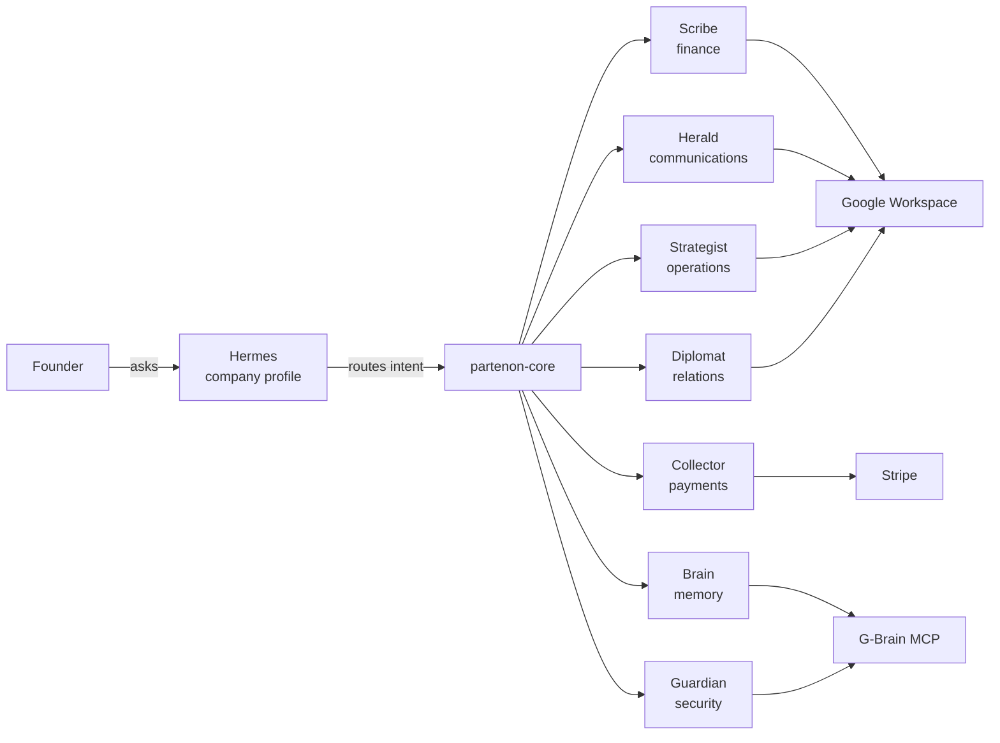

<p align="center">
  
</p>

<h1 align="center">Partenon</h1>

<p align="center">
  <strong>An AI agent operating system for small businesses, organized as a pantheon of heroes serving Hermes.</strong>
</p>

<p align="center">
  <a href="https://hermespartenon.online/">
    
  </a>
  <a href="https://github.com/cuentadeservicio377-cell/partenon">
    
  </a>
  
  
  
  
</p>

Partenon turns your company into a shared workspace where specialized AI agents handle finance, marketing, payments, security, operations, relationships, and memory. It is built on real Python skills, Hermes Agent profiles, Google Workspace, Stripe, and G-Brain.

The agents do not replace you; they keep the business organized in the tools you already use.

---

## What is Partenon



- **Hermes** = the company. Not a CEO, not a chatbot. The entity that publishes missions because it needs help.
- **The heroes** = seven specialized agents that take missions.
- **partenon-core** = the router, onboarding engine, workflow engine, and eval loop.
- **G-Brain** = shared memory across heroes.
- **Google Workspace / Stripe** = the delivery surface.

---

## Three real use cases

### 1. Coffee shop that finally sees its margin

The Scribe parses monthly bank exports, classifies costs as fixed or variable, and writes them into a Google Sheet. The owner sees that labor and supplies are eating 62% of revenue. The Strategist schedules a weekly review. In two weeks the owner adjusts scheduling and reduces waste.

**Outcome**: a live margin dashboard and a 15% cost reduction.

### 2. Agency that stops losing proposals

The Diplomat registers every prospect, logs calls, and tracks proposal milestones. The Strategist creates a project and checklist when a quote is approved. The Collector invoices the retainer and follows up automatically. The Herald turns closed deals into case-study content.

**Outcome**: no deal slips through the cracks; cash flow is visible weekly.

### 3. SaaS startup that secures its keys

The Guardian audits every profile's permissions and flags API keys older than 90 days. The Scribe tracks cloud and contractor spend against runway. The Collector manages Stripe subscriptions and failed payment retries. The Brain indexes pricing and positioning decisions for every new hire.

**Outcome**: clean access hygiene and a single source of truth for company decisions.

---

## Quick install

```bash
git clone https://github.com/cuentadeservicio377-cell/partenon.git
cd partenon
./install.sh
```

The installer creates a virtualenv, installs Python dependencies, copies `.env.example` to `.env`, and runs the Scribe demo.

Then:

```bash
# Verify the finance demo
python3 scripts/demo_tesorero.py

# Start the operations dashboard
cd dashboard
npm install
npm run dev
```

Open http://localhost:3000 and log in with `admin` / `partenon` (change these in `.env` via `DASHBOARD_APP_USERNAME` and `DASHBOARD_APP_PASSWORD`).

For a full 15-minute walkthrough, see [`docs/QUICKSTART.md`](docs/QUICKSTART.md).

---

## The seven heroes

| Hero | Role | Config file | What it does |
|------|------|-------------|--------------|
| **Scribe** | Finance / Treasurer | `.finance` | Parses expenses, builds Sheets dashboards, runs budget reviews, tracks vendors. |
| **Herald** | Communications / Messenger | `.design` | Brand interview, content calendars, copy, SEO/GEO, presentations. |
| **Collector** | Payments | `.payments` | Stripe links, subscriptions, invoices, reminders, fraud checks. |
| **Guardian** | Security | `.security` | API key rotation, access audit, policy management, audit logging. |
| **Strategist** | Operations | `.ops` | Projects, tasks, checklists, goals, briefings, calendar. |
| **Diplomat** | Relations | `.relations` | Clients, vendors, milestones, follow-ups, proposals. |
| **Brain** | Memory / Intelligence | `.brain` | Indexes decisions and learnings, searches context, detects conflicts. |

For per-hero tools, MCP servers, env vars, cron jobs, and prompts, see [`docs/HERO_GUIDE.md`](docs/HERO_GUIDE.md).

---

## Architecture

Partenon has four layers:

1. **Interface layer** — static marketing/technical pages (`web/`), the Next.js dashboard (`dashboard/`), and the Hermes Agent CLI.
2. **Core layer** — `partenon-core/tools/` handles routing, onboarding, workflows, evaluation, and config loading.
3. **Hero layer** — seven Hermes Agent distributions under `hermes/profiles/`, each with skills, tools, cron jobs, and templates.
4. **Integration layer** — MCP servers for Google Workspace, Stripe, Gmail, Calendar, and G-Brain, configured in `partenon-core/config/mcp/servers.yaml`.

For a detailed Mermaid diagram, see [`docs/assets/architecture-diagram.mmd`](docs/assets/architecture-diagram.mmd). For a concise capability matrix, see [`docs/assets/hero-matrix.md`](docs/assets/hero-matrix.md).

---

## Repository structure

```text
partenon/
├── web/                          # Static site (index, heroes, developers)
├── dashboard/                    # Next.js 15 + React 19 operations dashboard
├── partenon-core/                # Router, onboarding, workflow, eval loop
│   ├── tools/router.py
│   ├── tools/onboarding_engine.py
│   ├── tools/workflow_engine.py
│   ├── tools/eval_loop.py
│   └── config/mcp/servers.yaml
├── hermes/profiles/              # Seven hero profiles
│   ├── partenon-tesorero/        # Scribe
│   ├── partenon-mensajero/       # Herald
│   ├── partenon-cobrador/        # Collector
│   ├── partenon-guardian/        # Guardian
│   ├── partenon-estratega/       # Strategist
│   ├── partenon-diplomatico/     # Diplomat
│   └── partenon-brain/           # Brain
├── gbrain/                       # Local MCP memory server
├── scripts/                      # demo_tesorero.py, setup_hermes.py, capture.py
├── examples/                     # API stub, CLI stub, MCP client stub
├── templates/google-sheet-base/  # Finance spreadsheet generator
├── docs/                         # Documentation
├── install.sh
├── docker-compose.yml
└── requirements.txt
```

---

## Documentation

- [`docs/QUICKSTART.md`](docs/QUICKSTART.md) — working demo in 15 minutes.
- [`docs/ENTREPRENEUR_PLAYBOOK.md`](docs/ENTREPRENEUR_PLAYBOOK.md) — how to choose heroes, prompts, configs, and a 30-60-90 day rollout.
- [`docs/HERO_GUIDE.md`](docs/HERO_GUIDE.md) — deep technical guide for each hero.
- [`docs/SECURITY.md`](docs/SECURITY.md) — credentials, rotation, audit logs, and Guardian responsibilities.
- [`docs/API.md`](docs/API.md) — Python core, scripts, example stubs, and G-Brain MCP reference.
- [`docs/FAQ.md`](docs/FAQ.md) — honest answers to common questions.
- [`docs/assets/hero-matrix.md`](docs/assets/hero-matrix.md) — one-page capability matrix.
- [`MISSING_IMPLEMENTATION.md`](MISSING_IMPLEMENTATION.md) — current gaps and suggested priorities.

---

## Roadmap

- [ ] Functional eval loop wired into the router and hero runtime.
- [ ] Live Google Workspace, Stripe, and G-Brain integrations with real credentials.
- [ ] Real workflow engine dispatch to hero tools instead of local JSON stubs.
- [ ] Publishing and dispatch integrations for Herald, Collector, and Diplomat.
- [ ] Automated tests for `partenon-core` and every hero skill.
- [ ] Standardized `GBRAIN_DATABASE_URL` variable name across `.env` and `gbrain/`.
- [ ] CI pipeline and linting/formatting config.

---

## Known gaps

- The eval loop in `partenon-core/tools/eval_loop.py` scores outputs but is not yet wired into mission execution.
- The workflow engine emits and processes events locally; it does not yet dispatch to external heroes or APIs.
- Live integrations require real credentials and are not enabled by default.
- There is no `tests/` directory or CI workflow yet.
- The `GBRAIN_DATABASE_URL` / `GBrain_DATABASE_URL` naming inconsistency remains.

See [`MISSING_IMPLEMENTATION.md`](MISSING_IMPLEMENTATION.md) for the full audit.

---

## Related projects

- [Hermes Agent](https://hermes-agent.nousresearch.com/)
- [NVIDIA NemoClaw](https://www.nvidia.com/en-us/ai/nemoclaw/)
- [Stripe Agent Toolkit](https://github.com/stripe/ai)
- [G-Brain](https://github.com/garrytan/gbrain)

---

## Status

- Live site: https://hermespartenon.online/
- Repository: https://github.com/cuentadeservicio377-cell/partenon
- Verified: `python3 scripts/demo_tesorero.py` and `cd dashboard && npm run build` pass locally.
