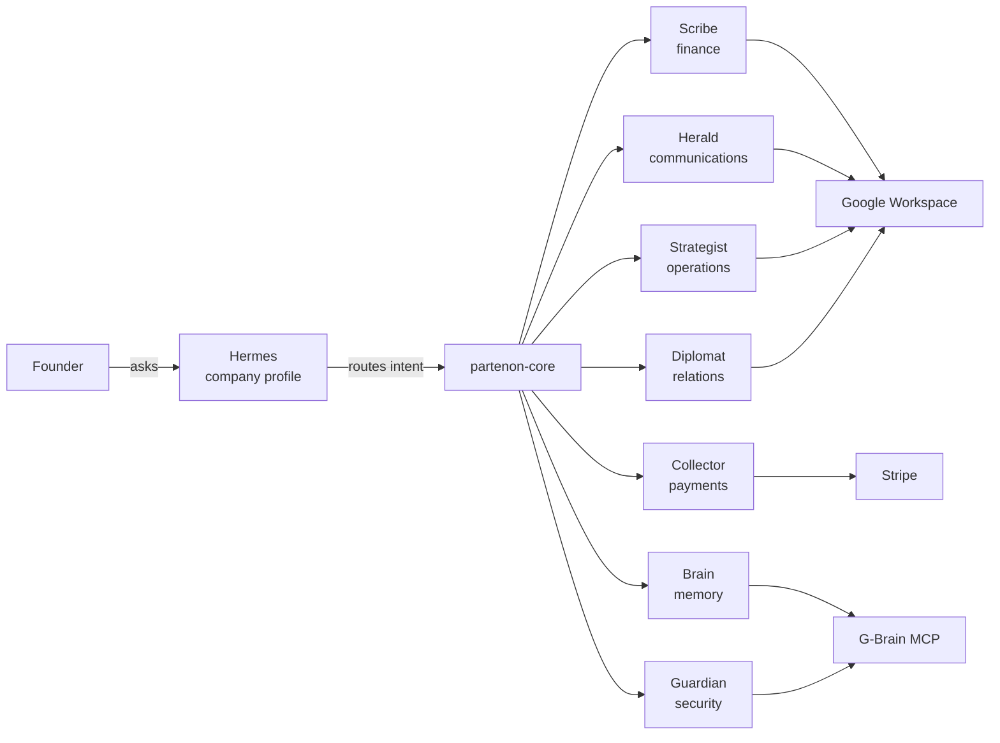

<p align="center">
  
</p>

<h1 align="center">Partenon</h1>

<p align="center">
  <strong>An AI agent operating system for small businesses, organized as a pantheon of heroes serving Hermes.</strong>
</p>

<p align="center">
  <a href="https://hermespartenon.online/">
    
  </a>
  <a href="https://github.com/cuentadeservicio377-cell/partenon">
    
  </a>
  
  
  
  
</p>

Partenon turns your company into a shared workspace where specialized AI agents handle finance, marketing, payments, security, operations, relationships, and memory. It is built on real Python skills, Hermes Agent profiles, Google Workspace, Stripe, and G-Brain.

The agents do not replace you; they keep the business organized in the tools you already use.

---

## What is Partenon



- **Hermes** = the company. Not a CEO, not a chatbot. The entity that publishes missions because it needs help.
- **The heroes** = seven specialized agents that take missions.
- **partenon-core** = the router, onboarding engine, workflow engine, and eval loop.
- **G-Brain** = shared memory across heroes.
- **Google Workspace / Stripe** = the delivery surface.

---

## Three real use cases

### 1. Coffee shop that finally sees its margin

The Scribe parses monthly bank exports, classifies costs as fixed or variable, and writes them into a Google Sheet. The owner sees that labor and supplies are eating 62% of revenue. The Strategist schedules a weekly review. In two weeks the owner adjusts scheduling and reduces waste.

**Outcome**: a live margin dashboard and a 15% cost reduction.

### 2. Agency that stops losing proposals

The Diplomat registers every prospect, logs calls, and tracks proposal milestones. The Strategist creates a project and checklist when a quote is approved. The Collector invoices the retainer and follows up automatically. The Herald turns closed deals into case-study content.

**Outcome**: no deal slips through the cracks; cash flow is visible weekly.

### 3. SaaS startup that secures its keys

The Guardian audits every profile's permissions and flags API keys older than 90 days. The Scribe tracks cloud and contractor spend against runway. The Collector manages Stripe subscriptions and failed payment retries. The Brain indexes pricing and positioning decisions for every new hire.

**Outcome**: clean access hygiene and a single source of truth for company decisions.

---

## Quick install

```bash
git clone https://github.com/cuentadeservicio377-cell/partenon.git
cd partenon
./install.sh
```

The installer auto-detects Python 3.10+ (it searches `python3.14`, `python3.13`, ..., `python3.10` before falling back to `python3`), creates a virtualenv, installs dependencies, copies `.env.example` to `.env`, and runs the Scribe demo.

Then:

```bash
# Verify the finance demo
python3 scripts/demo_scribe.py

# Start the API backend
. .venv/bin/activate
uvicorn partenon_api.main:app --reload --port 8000

# In another terminal, start the operations dashboard
cd dashboard
npm install
npm run dev
```

Open http://localhost:3000 and log in with the credentials generated in `.env` (`DASHBOARD_APP_USERNAME` and `DASHBOARD_APP_PASSWORD`). If `.env` does not exist, run `./install.sh` first.

The dashboard talks to the FastAPI backend at `PARTENON_API_URL` (default `http://127.0.0.1:8000`) using JWT sessions signed with `PARTENON_API_SECRET` (or `DASHBOARD_AUTH_SECRET` as a fallback).

For a full 15-minute walkthrough, see [`docs/QUICKSTART.md`](docs/QUICKSTART.md).

---

## The seven heroes

| Hero | Role | Config file | What it does |
|------|------|-------------|--------------|
| **Scribe** | Finance / Treasurer | `.finance` | Parses expenses, builds Sheets dashboards, runs budget reviews, tracks vendors. |
| **Herald** | Communications / Messenger | `.design` | Brand interview, content calendars, copy, SEO/GEO, presentations. |
| **Collector** | Payments | `.payments` | Stripe links, subscriptions, invoices, reminders, fraud checks. |
| **Guardian** | Security | `.security` | API key rotation, access audit, policy management, audit logging. |
| **Strategist** | Operations | `.ops` | Projects, tasks, checklists, goals, briefings, calendar. |
| **Diplomat** | Relations | `.relations` | Clients, vendors, milestones, follow-ups, proposals. |
| **Brain** | Memory / Intelligence | `.brain` | Indexes decisions and learnings, searches context, detects conflicts. |

For per-hero tools, MCP servers, env vars, cron jobs, and prompts, see [`docs/HERO_GUIDE.md`](docs/HERO_GUIDE.md).

---

## Architecture

Partenon has four layers:

1. **Interface layer** — static marketing/technical pages (`web/`), the Next.js dashboard (`dashboard/`), and the Hermes Agent CLI.
2. **Core layer** — `partenon_core/tools/` handles routing, onboarding, workflows, evaluation, and config loading.
3. **Hero layer** — seven Hermes Agent distributions under `hermes/profiles/`, each with skills, tools, cron jobs, and templates.
4. **Integration layer** — MCP servers for Google Workspace, Stripe, Gmail, Calendar, and G-Brain, configured in `partenon_core/config/mcp/servers.yaml`.

For a detailed Mermaid diagram, see [`docs/assets/architecture-diagram.mmd`](docs/assets/architecture-diagram.mmd). For a concise capability matrix, see [`docs/assets/hero-matrix.md`](docs/assets/hero-matrix.md).

---

## Live integrations setup

Partenon ships dry-run by default. To enable live calls, set the relevant variables in `.env` and pass `dry_run=false` to the tool.

| Service | Required env vars | Heroes | What becomes live |
|---|---|---|---|
| **Google Workspace** | `GOOGLE_SERVICE_ACCOUNT_JSON` (path to service-account JSON) or `GOOGLE_OAUTH_CLIENT_ID` + `GOOGLE_OAUTH_CLIENT_SECRET` | Scribe, Herald, Strategist, Diplomat | Sheets, Docs, Slides, Calendar events, Gmail sends |
| **Stripe** | `STRIPE_SECRET_KEY` | Collector | Payment links, invoices, subscriptions, charge reports, fraud checks |
| **Stripe webhooks** | `STRIPE_WEBHOOK_SECRET` (optional, for signature verification) | Collector | `/webhooks/stripe` emits `payment_confirmed` to the workflow engine |
| **Slack** | `SLACK_BOT_TOKEN`, `SLACK_TEAM_ID` | Strategist | Task-overdue notifications posted to a channel |
| **G-Brain** | `GBRAIN_DATABASE_URL` | Brain, all heroes | Persistent memory (defaults to local SQLite) |

Start the Stripe webhook handler locally:

```bash
python3 -m mcp_servers.payments.webhook
```

Then configure Stripe to send `checkout.session.completed` and `invoice.paid` events to `http://<your-host>:8000/webhooks/stripe`.

---

## Repository structure

```text
partenon/
├── web/                          # Static site (index, heroes, developers)
├── dashboard/                    # Next.js 15 + React 19 operations dashboard
├── partenon_api/                 # FastAPI backend: missions, cron, heroes, events, SSE
│   ├── main.py
│   ├── auth.py
│   ├── store.py
│   ├── events.py
│   └── routers/
├── partenon_core/                # Router, onboarding, workflow, eval loop
│   ├── tools/router.py
│   ├── tools/onboarding_engine.py
│   ├── tools/workflow_engine.py
│   ├── tools/eval_loop.py
│   └── config/mcp/servers.yaml
├── hermes/profiles/              # Seven hero profiles
│   ├── partenon-scribe/        # Scribe
│   ├── partenon-herald/       # Herald
│   ├── partenon-collector/        # Collector
│   ├── partenon-guardian/        # Guardian
│   ├── partenon-strategist/       # Strategist
│   ├── partenon-diplomat/     # Diplomat
│   └── partenon-brain/           # Brain
├── mcp_servers/                  # MCP servers: memory, finance, payments, comms, security, ops, relations
├── skills/                       # Hermes skills: partenon-core, partenon-judge, partenon-workflows
├── scripts/                      # demo_scribe.py, setup_hermes.py, capture.py
├── examples/                     # API stub, CLI stub, MCP client stub
├── templates/google-sheet-base/  # Finance spreadsheet generator
├── docs/                         # Documentation
├── install.sh
├── docker-compose.yml
├── pyproject.toml
├── distribution.yaml
└── requirements.txt
```

---

## Documentation

- [`docs/QUICKSTART.md`](docs/QUICKSTART.md) — working demo in 15 minutes.
- [`docs/ENTREPRENEUR_PLAYBOOK.md`](docs/ENTREPRENEUR_PLAYBOOK.md) — how to choose heroes, prompts, configs, and a 30-60-90 day rollout.
- [`docs/HERO_GUIDE.md`](docs/HERO_GUIDE.md) — deep technical guide for each hero.
- [`docs/SECURITY.md`](docs/SECURITY.md) — credentials, rotation, audit logs, and Guardian responsibilities.
- [`docs/API.md`](docs/API.md) — Python core, scripts, example stubs, and G-Brain MCP reference.
- [`docs/FAQ.md`](docs/FAQ.md) — honest answers to common questions.
- [`docs/assets/hero-matrix.md`](docs/assets/hero-matrix.md) — one-page capability matrix.
- [`docs/PARTENON_GUIDE.pdf`](docs/PARTENON_GUIDE.pdf) — printable A4 guide with web aesthetic: concept, heroes, install, workshop, simulations, playbook, security, readiness, roadmap.
- [`workshop/README.md`](workshop/README.md) — reusable workshop kit with company cards, simulations, agendas, and handouts.
- [`workshop/guides/HERMES_ONBOARDING.md`](workshop/guides/HERMES_ONBOARDING.md) — how Hermes should guide a new company through setup.
- [`workshop/checklists/PRODUCTION_READINESS.md`](workshop/checklists/PRODUCTION_READINESS.md) — PASS/FAIL/PARTIAL evidence from the production-readiness test.
- [`MISSING_IMPLEMENTATION.md`](MISSING_IMPLEMENTATION.md) — current gaps and suggested priorities.

---

## Roadmap

- [x] Phase 1 — Hermes-native foundation: `distribution.yaml`, `pyproject.toml`, `partenon_core` package, MCP servers, profile install.
- [x] Phase 2 — Hero final design: dry-run/live tool lists, SOUL/SKILL rewrites, handoff workflows, interaction tests.
- [x] Phase 3 — Real integrations: Google Workspace, Stripe live + webhook, Slack notifications, Guardian key/model audit.
- [x] Phase 4 — Real-time dashboard + API: FastAPI backend, SSE, JWT auth, workspace isolation.
- [x] Repair Sprint — MCP runtime unification: API store, workflow engine, and integrations now use the Hermes `partenon-memory` and domain MCP servers instead of parallel JSON files.
- [ ] Phase 5 — Gateway messaging: Telegram/Email gateway, command namespace, file routing.
- [ ] Phase 6 — Deployment world: Docker Compose, CI/CD, structured logging, metrics, release process.
- [ ] Phase 7 — Website reality: audit marketing claims, capabilities page, screenshots.
- [ ] Functional eval loop wired into the router and hero runtime.
- [ ] Publishing and dispatch integrations for Herald, Collector, and Diplomat.

---

## Known gaps

- The eval loop in `partenon_core/tools/eval_loop.py` scores outputs but is not yet wired into mission execution.
- Live integrations require real credentials and are not enabled by default.
- Gateway messaging (Telegram/Email) is configured but not yet wired end-to-end.
See [`MISSING_IMPLEMENTATION.md`](MISSING_IMPLEMENTATION.md) for the full audit.

---

## Related projects

- [Hermes Agent](https://hermes-agent.nousresearch.com/)
- [NVIDIA NemoClaw](https://www.nvidia.com/en-us/ai/nemoclaw/)
- [Stripe Agent Toolkit](https://github.com/stripe/ai)
- [G-Brain](https://github.com/garrytan/gbrain)

---

## Status

- Live site: https://hermespartenon.online/
- Repository: https://github.com/cuentadeservicio377-cell/partenon
- Verified locally (2026-06-29):
  - `python3 scripts/demo_scribe.py` PASS.
  - `python3 -m pytest tests/` PASS (117 tests).
  - `ruff check partenon_api tests partenon_core/tools/workflow_engine.py` PASS.
  - `cd dashboard && npm run lint` PASS.
  - `cd dashboard && npm run build` PASS.
  - `./install.sh` idempotent PASS.
  - `.github/scripts/secret_scan.py` PASS.
  - `hermes profile install hermes/profiles/partenon-*` PASS for all 7 heroes.
  - `pip install -e .` and `python -m partenon_core.tools.router` PASS.
